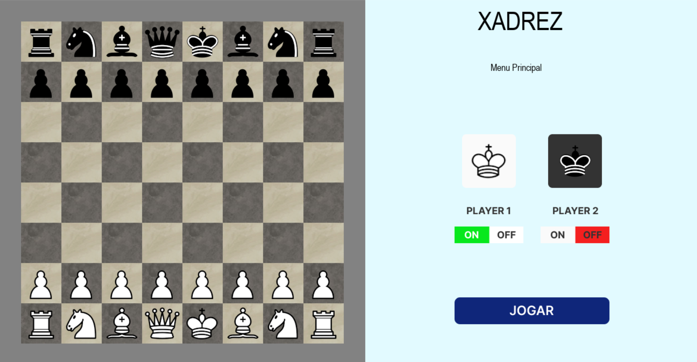
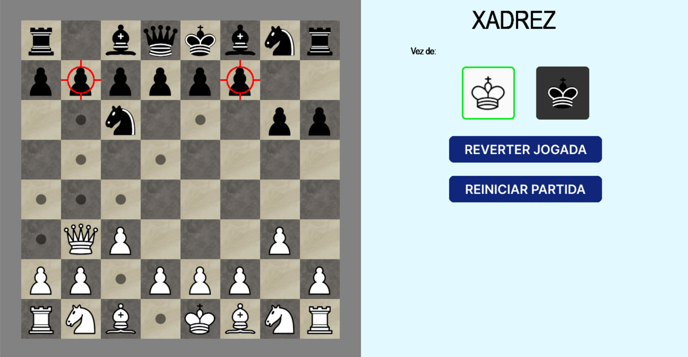

# ♟️ | Xadrez game!

Jogo de xadrez construído em python, rodando através da ferramenta Pygame! Jogo pode ser jogado sozinho ou multiplayer local! Caso jogue sozinho, jogará contra uma IA.

## 🛠️ Intalação:

1. Clone este repositório com `git clone` ou baixe o código-fonte e as pastas devidas.
2. Instalação de Python, caso não estiver previamente instalada em seu computador
3. Instale as dependências, caso houver: `pip install pygame`

## 🚀 Execução:

Digitar em seu terminal: `python game.py` ou clicar em `run` através de seu VS Code!

## 📩 Dúvidas:

Qualquer dúvida, pode enviar um email para: [Miguel Rossi Fermo](mailto:miguelrossifermo05@gmail.com)

## Demonstração do Jogo:

